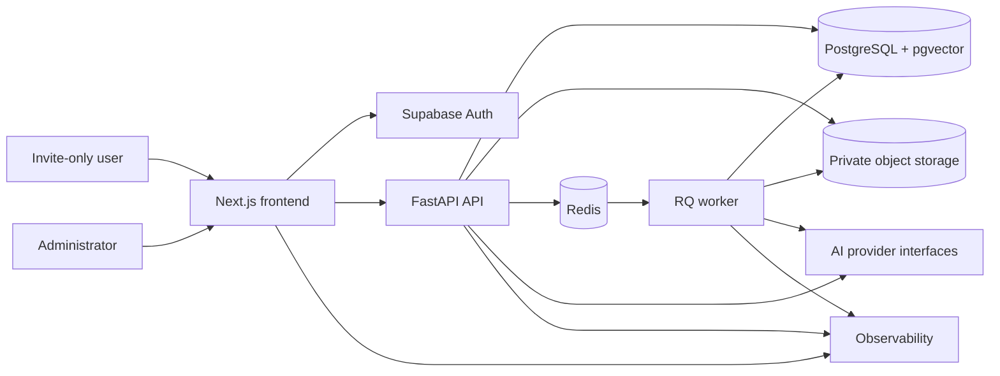
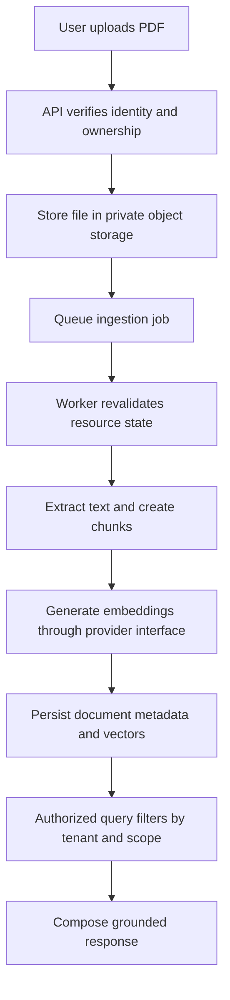

# System Overview

## Context Diagram

## High-Level Data Flow

## Responsibilities

- `Next.js`: user interface, authenticated requests, and presentation of citations, memory controls, and deletion state.
- `Supabase Auth`: verified identity and token issuance.
- `FastAPI`: deterministic application authorization, domain orchestration, validation, and API boundary enforcement.
- `PostgreSQL/pgvector`: durable metadata, ownership-scoped retrieval, vector search, and relational state.
- `Private object storage`: private document and derived file storage with authorization-gated access.
- `Redis`: job queue transport and coordination for bounded background work.
- `RQ worker`: ingestion and other background tasks with ownership and state revalidation before action.
- `AI provider interfaces`: isolated adapters for deterministic tests, local development, and optional hosted AI providers.
- `Observability`: structured, privacy-safe logs and operational signals without exposing raw private content or secrets.

## Request Authorization Sequence

1. The client sends a request with a verified token.
2. FastAPI validates identity from the token.
3. The application resolves the authenticated owner from trusted identity data, not from client-supplied owner identifiers.
4. Authorization checks run before any data access or mutation.
5. The request reaches the database, storage, or worker path only after ownership and scope are confirmed.
6. Any retrieval path applies tenant filtering before ranking or response assembly.

## PDF Ingestion Sequence

1. A user submits a PDF through the authenticated frontend.
2. FastAPI verifies ownership, quota eligibility, and document state.
3. The file is stored privately.
4. An ingestion job is queued.
5. The worker revalidates ownership, deletion state, and job eligibility before processing.
6. Text is extracted from supported PDFs only.
7. Chunks and embeddings are created and persisted with tenant scope.
8. The document becomes available for grounded retrieval only after successful processing.

## Future Answer-Generation Context Sources

Future answer generation may draw from:

- current conversation;
- conversation summary;
- approved memories;
- document evidence.

These source types remain distinguishable so the system can preserve provenance, control memory influence, and keep retrieval behavior auditable.

## Architectural Boundaries

This milestone does not define SQL tables or API contracts. Those belong to later implementation milestones.
